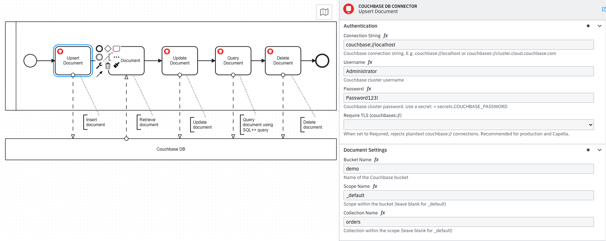
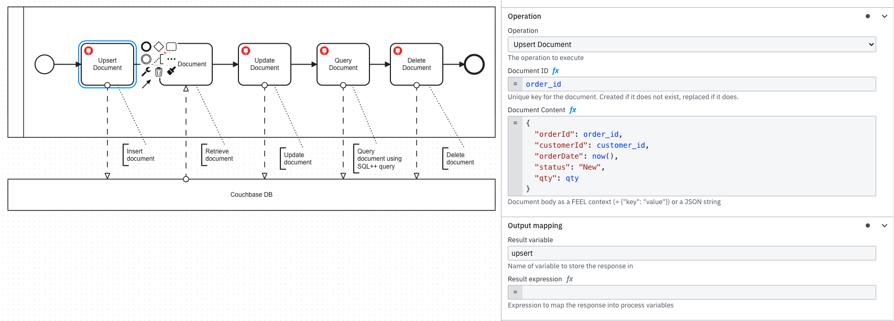
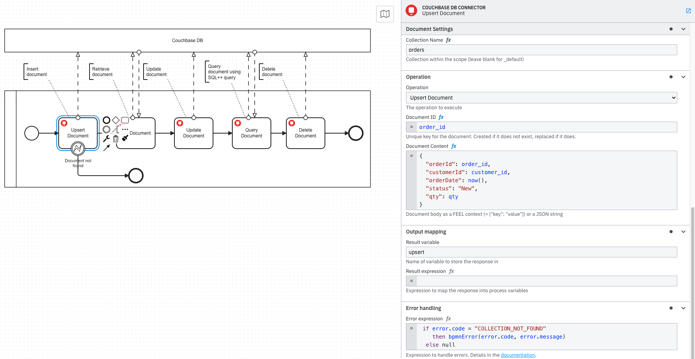

[](https://github.com/Camunda-Community-Hub/community/blob/main/extension-lifecycle.md#incubating-)
[](https://github.com/camunda-community-hub/community)

# Couchbase DB Connector for Camunda 8

A custom [Camunda 8 outbound connector](https://docs.camunda.io/docs/components/connectors/custom-built-connectors/connector-sdk/) that integrates with [Couchbase](https://www.couchbase.com) — Community, Enterprise, and Capella — directly from a BPMN process. Perform document key-value operations and execute N1QL/SQL++ queries without writing a custom job worker.

---

## Features

- **Get Document** — Retrieve any document by its key from a bucket, scope, and collection.
- **Upsert Document** — Insert or fully replace a document. Idempotent — safe to call more than once.
- **Replace Document** — Replace the content of an existing document; fails with `DOCUMENT_NOT_FOUND` if the key does not exist.
- **Delete Document** — Remove a document by its key.
- **Execute N1QL Query** — Run a SQL++ / N1QL query and return rows as a FEEL-compatible list. Supports positional parameters, configurable scan consistency, per-query timeout, and an automatic `LIMIT` guardrail to prevent unbounded result sets.
- **SELECT-only policy** — Optionally restrict query tasks to read-only `SELECT` statements, preventing accidental mutations from process data.
- **TLS enforcement** — Optionally require `couchbases://` connections and reject plaintext `couchbase://` at configuration time.
- **Connection pooling** — Cluster connections are cached (max 50, 30-minute idle TTL) so each process instance does not reconnect from scratch.

---

## Example



*The BPMN process exercising all five operations, with the Authentication and Document Settings panel for the Upsert Document task.*



*The Operation panel showing the operation selector, Document ID, and Document Content fields with FEEL expression.*

---

## Usage

### Authentication

All operations share the same **Authentication** section.

| Field | Required | Description |
|---|---|---|
| **Connection String** | Yes | `couchbase://localhost` for local; `couchbases://cb.host.cloud.couchbase.com` for Capella. Use `= secrets.COUCHBASE_CONNECTION_STRING` |
| **Username** | Yes | Couchbase cluster username. Use `= secrets.COUCHBASE_USERNAME` |
| **Password** | Yes | Couchbase cluster password. Use `= secrets.COUCHBASE_PASSWORD` |
| **Require TLS** | No | Set to **Required (production)** to reject `couchbase://` connections and enforce `couchbases://`. Default: Disabled. |

---

### Operation: Get Document

Retrieves a single document by its key.

#### Input

| Field | Required | Description |
|---|---|---|
| **Bucket Name** | Yes | Bucket containing the document |
| **Scope Name** | No | Scope within the bucket. Default: `_default` |
| **Collection Name** | No | Collection within the scope. Default: `_default` |
| **Document ID** | Yes | The unique document key, e.g. `customer::001` |

#### Output

```json
{
  "id": "customer::001",
  "content": { "name": "Alice Smith", "tier": "gold" },
  "cas": 1718716800000000000
}
```

**Example result expression:**

```feel
= {
  customerName: response.content.name,
  customerTier: response.content.tier
}
```

---

### Operation: Upsert Document

Inserts a new document or fully replaces it if the key already exists. Safe to call multiple times (idempotent).

#### Input

| Field | Required | Description |
|---|---|---|
| **Bucket Name** | Yes | Target bucket |
| **Scope Name** | No | Scope within the bucket. Default: `_default` |
| **Collection Name** | No | Collection within the scope. Default: `_default` |
| **Document ID** | Yes | Unique document key |
| **Document Content** | Yes | FEEL context `= { "field": value }` or a JSON string |

**FEEL example:**

```feel
= {
  "orderId": orderId,
  "customerId": customerId,
  "qty": qty,
  "orderDate": today(),
  "status": "Pending"
}
```

#### Output

```json
{ "id": "ORD-1001", "cas": 1718716800000000000, "success": true }
```

---

### Operation: Replace Document

Replaces the content of an existing document. Fails with `DOCUMENT_NOT_FOUND` if the key does not exist — use **Upsert** when the document may not be present yet.

#### Input

Same fields as [Upsert Document](#operation-upsert-document).

#### Output

```json
{ "id": "ORD-1001", "cas": 1718716801000000000, "success": true }
```

---

### Operation: Delete Document

Removes a document by its key.

#### Input

| Field | Required | Description |
|---|---|---|
| **Bucket Name** | Yes | Bucket containing the document |
| **Scope Name** | No | Scope within the bucket. Default: `_default` |
| **Collection Name** | No | Collection within the scope. Default: `_default` |
| **Document ID** | Yes | The unique document key to delete |

#### Output

```json
{ "id": "ORD-1001", "cas": 1718716802000000000, "success": true }
```

---

### Operation: Execute N1QL Query

Runs a SQL++ / N1QL query and returns matching rows as a list. Supports positional parameters, per-query timeout, scan consistency, a row cap, and an optional SELECT-only policy.

#### Input

| Field | Required | Description |
|---|---|---|
| **N1QL / SQL++ Query** | Yes | The query string. Use `$1`, `$2`… for positional parameters. Do not include a trailing semicolon. |
| **Positional Parameters** | No | FEEL list, e.g. `= ["gold", 100]`. Maps to `$1`, `$2` in the query. |
| **Max Rows** | No | Maximum rows to return. A `LIMIT` clause is automatically appended if the query has none. Default: `1000`. |
| **Query Timeout (seconds)** | No | Server-side execution timeout. Default: `30`. |
| **Scan Consistency** | No | `NOT_BOUNDED` (fastest, may read stale data) or `REQUEST_PLUS` (consistent with all prior mutations). Default: `NOT_BOUNDED`. |
| **Statement Policy** | No | `Any statement` (default) or `SELECT only` — rejects non-SELECT statements with `QUERY_POLICY_VIOLATION`. |

**Query example (static):**

```sql
SELECT orderId, customerId, qty, orderDate
FROM `demo`.`_default`.`orders`
WHERE status = "Pending"
```

**Query example (parameterised):**

```sql
SELECT * FROM `demo`.`_default`.`customers` WHERE tier = $1
```

With **Positional Parameters**: `= ["gold"]`

#### Output

```json
{
  "rows": [
    { "orderId": "ORD-1001", "customerId": "customer::001", "qty": 2, "orderDate": "2026-06-17" }
  ],
  "rowCount": 1
}
```

**Example result expression:**

```feel
= {
  orders:     response.rows,
  orderCount: response.rowCount
}
```

---

## Output Variables

Map connector output to process variables using the **Output Mapping** section in the element template:

| Result expression | Suggested variable | Description |
|---|---|---|
| `= response.content` | `documentContent` | Document body (Get) |
| `= response.id` | `documentId` | Document key written or deleted |
| `= response.cas` | `documentCas` | CAS value for optimistic-locking checks |
| `= response.success` | `opSuccess` | `true` on successful write or delete |
| `= response.rows` | `queryRows` | List of row objects from a query |
| `= response.rowCount` | `queryRowCount` | Number of rows returned |

---

## Error Reference

| Error Code | Operation | Cause | Resolution |
|---|---|---|---|
| `DOCUMENT_NOT_FOUND` | Get, Replace, Delete | No document exists for the given key | Verify the Document ID and bucket/scope/collection path |
| `COLLECTION_NOT_FOUND` | Get, Upsert, Replace, Delete | The bucket, scope, or collection name does not exist | Verify the bucket, scope, and collection names — check for typos such as trailing underscores |
| `UPSERT_FAILED` | Upsert | KV write failed for an unexpected reason | Check connector logs for detail |
| `REPLACE_FAILED` | Replace | KV write failed | Same as above; also ensure the document already exists |
| `DELETE_FAILED` | Delete | KV remove failed | Check document exists and credentials have write access |
| `QUERY_FAILED` | Query | N1QL execution error (syntax error, missing index, auth) | Verify the query syntax; ensure a primary or covering index exists on the collection |
| `QUERY_POLICY_VIOLATION` | Query | Non-SELECT statement submitted when **Statement Policy** is set to `SELECT only` | Change the statement policy or use a SELECT query |
| `INVALID_CONTENT` | Upsert, Replace | Document content is not a valid JSON object or FEEL context | Ensure the content field evaluates to a FEEL context `= { ... }` or a valid JSON string |
| `TLS_REQUIRED` | All | `couchbase://` connection string used when **Require TLS** is enabled | Change the connection string to `couchbases://` or disable the TLS requirement |
| `GET_FAILED` | Get | Unexpected error during retrieval | Check connector logs for internal detail |
| `AUTHENTICATION_FAILED` | All | Wrong credentials or expired password; also raised mid-operation when a cached cluster becomes invalid after credential rotation | Verify the Couchbase username and password; the stale cluster is evicted automatically so the next attempt will reconnect |
| `CONNECTION_TIMEOUT` | All | Connection to the Couchbase cluster did not become ready within the 15-second timeout | Verify the connection string and ensure the cluster is reachable from the connector host |
| `UNKNOWN_HOST` | All | The hostname in the connection string could not be resolved (DNS failure) | Verify the hostname in the connection string and check DNS resolution from the connector host |
| `CONNECTION_FAILED` | All | Unexpected error while establishing the cluster connection | Check the connection string, credentials, and network; review connector logs for the root cause |

Use the **Error Handling** section in the element template to catch these codes with BPMN boundary error events.



*The Error Handling panel configured with a FEEL `errorExpression` that catches `COLLECTION_NOT_FOUND` and maps it to a named BPMN error for a boundary event.*

---

## Kubernetes Deployment

See [k8s/README.md](k8s/README.md) for full instructions covering:

- Building and pushing the connector Docker image to `ghcr.io/camunda-community-hub/`
- **Option A** — Independent pod deployment with the official `camunda/connectors-bundle`
- **Option B** — Injection into an existing Camunda Helm chart deployment (8.9)

---

## References

- [Couchbase Java SDK — Getting started](https://docs.couchbase.com/java-sdk/current/hello-world/start-using-sdk.html)
- [Couchbase N1QL / SQL++ language reference](https://docs.couchbase.com/server/current/n1ql/n1ql-language-reference/index.html)
- [Couchbase Capella — connect to your cluster](https://docs.couchbase.com/cloud/get-started/connect.html)
- [Camunda Connector SDK](https://docs.camunda.io/docs/components/connectors/custom-built-connectors/connector-sdk/)
- [Camunda — Host custom connectors](https://docs.camunda.io/docs/components/connectors/custom-built-connectors/host-custom-connectors/)
- [Camunda — Use connectors in hybrid mode](https://docs.camunda.io/docs/guides/use-connectors-in-hybrid-mode/)

---

## Contributing

Contributions are welcome! Please read [CONTRIBUTING.md](CONTRIBUTING.md) for guidelines on how to report bugs, suggest features, and submit pull requests.

---

## License

This project is licensed under the [Apache License 2.0](LICENSE).
