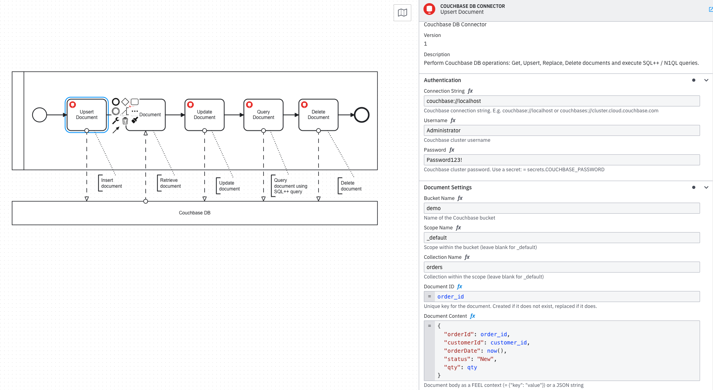

[](https://github.com/Camunda-Community-Hub/community/blob/main/extension-lifecycle.md#incubating-)
[](https://github.com/camunda-community-hub/community)

# Couchbase DB Connector for Camunda 8

A custom [Camunda 8 outbound connector](https://docs.camunda.io/docs/components/connectors/custom-built-connectors/connector-sdk/) that integrates with [Couchbase](https://www.couchbase.com) — Community, Enterprise, and Capella — directly from a BPMN process. Perform document key-value operations and execute N1QL/SQL++ queries without writing a custom job worker.

---

## Features

- **Get Document** — Retrieve any document by its key from a bucket, scope, and collection.
- **Upsert Document** — Insert or fully replace a document. Idempotent — safe to call more than once.
- **Replace Document** — Replace the content of an existing document; fails with `DOCUMENT_NOT_FOUND` if the key does not exist.
- **Delete Document** — Remove a document by its key.
- **Execute N1QL Query** — Run a SQL++ / N1QL query and return rows as a FEEL-compatible list. Supports positional parameters, configurable scan consistency, per-query timeout, and an automatic `LIMIT` guardrail to prevent unbounded result sets.
- **SELECT-only policy** — Optionally restrict query tasks to read-only `SELECT` statements, preventing accidental mutations from process data.
- **TLS enforcement** — Optionally require `couchbases://` connections and reject plaintext `couchbase://` at configuration time.
- **Connection pooling** — Cluster connections are cached (max 50, 30-minute idle TTL) so each process instance does not reconnect from scratch.

---

## Example



*Left: a BPMN process exercising all five operations. Right: the connector properties panel in Camunda Desktop Modeler showing an Upsert Document task configured with bucket, scope, collection, and document content.*

---

## Prerequisites

### Couchbase Cluster

You need a running Couchbase cluster accessible from the connector runtime:

| Option | Notes |
|---|---|
| **Couchbase Community / Enterprise (self-hosted)** | Version 7.x or later. Expose ports `11210` (KV), `8093` (N1QL), and optionally `8091` (admin UI). |
| **Couchbase Capella (SaaS)** | Use `couchbases://` connection string. TLS is required; obtain the connection string from the Capella console. |
| **Docker (local development)** | See the [Local Couchbase](#local-couchbase-docker) section. Port `8091` must be remapped if Camunda 8 Run is also running locally. |

Before running any query operation, ensure the target collection has at least a primary index:

```sql
CREATE PRIMARY INDEX IF NOT EXISTS ON `bucket`.`scope`.`collection`;
```

### Build Tools

Required only to build the connector from source:

- Java 21
- Maven 3.8+

---

## Element Template

Import the connector template into **Camunda Desktop Modeler** so the Couchbase DB Connector appears in the connector palette:

1. Copy `element-templates/couchbase-connector.json` to your Modeler's element templates directory:

   | OS | Path |
   |---|---|
   | macOS | `~/Library/Application Support/camunda-modeler/resources/element-templates/` |
   | Windows | `%APPDATA%\camunda-modeler\resources\element-templates\` |
   | Linux | `~/.config/camunda-modeler/resources/element-templates/` |

2. Restart the Modeler (or use **File → Reload Element Templates** if your version supports it).

The **Couchbase DB Connector** entry will appear when you click a service task and open the **Template** tab in the properties panel.

> **Rebuild the template after code changes:** run `mvn package -DskipTests` — the plugin regenerates `element-templates/couchbase-connector.json` automatically.

---

## Deployment

For general connector runtime setup, follow the official Camunda documentation for your target environment. The steps below cover only what is **specific to this connector** — placing the JAR and configuring Couchbase secrets.

Build the connector JAR before deploying to any environment:

```bash
mvn package -DskipTests
```

---

### C8 Run (Local / Development)

Official guide: **[Host custom connectors](https://docs.camunda.io/docs/components/connectors/custom-built-connectors/host-custom-connectors/)**

| Step | Action |
|---|---|
| 1. Place JAR | Copy `target/connector-couchbase-1.0.0-SNAPSHOT-with-dependencies.jar` into `<c8run>/custom_connectors/` |
| 2. Set secrets | Export `COUCHBASE_*` variables before starting the runtime (see below) |
| 3. Start runtime | Run `bash <c8run>/start-connectors.sh` |
| 4. Verify | Look for `Starting job worker: Couchbase DB Connector with type io.camunda:couchbase:1` in the log |

> **Important:** The runtime must be started with `-Dloader.path=custom_connectors` (not `-cp`) so Spring Boot's `LaunchedClassLoader` resolves the connector SDK classes from inside the runtime JAR. The provided `start-connectors.sh` already uses the correct flag.

Secrets to export before starting the runtime:

```bash
export COUCHBASE_CONNECTION_STRING="couchbase://localhost"
export COUCHBASE_USERNAME="Administrator"
export COUCHBASE_PASSWORD="<your-password>"
```

Reference these in the connector's Authentication fields using FEEL secrets syntax:

```
= secrets.COUCHBASE_CONNECTION_STRING
= secrets.COUCHBASE_USERNAME
= secrets.COUCHBASE_PASSWORD
```

> To persist credentials across restarts, add the `export` lines to a wrapper script that delegates to `start-connectors.sh`, or add them to `connectors-application.properties` using the `camunda.connector.auth.secrets.*` prefix. Never commit credential files to source control.

---

### Self-Managed on Kubernetes (Helm)

Official guide: **[Camunda Helm chart installation](https://docs.camunda.io/docs/self-managed/installation-methods/helm/)** — chart version **14.x** (Camunda 8.9)

> **Chart 14.x:** Zeebe, Operate, and Tasklist are unified under a single `orchestration` key. There are no separate `zeebe`, `operate`, or `tasklist` top-level Helm values.

| Step | Action |
|---|---|
| 1. Build image | Extend `camunda/connectors-bundle:8.9.5` and copy the connector JAR into `/opt/custom_connectors/` |
| 2. Set secrets | Use a Kubernetes Secret (Option A) or the Camunda Administration UI (Option B) |
| 3. Override image | Set `connectors.image.repository` and `connectors.image.tag` in your `values.yaml` |
| 4. Deploy | `helm install` / `helm upgrade` with your `values.yaml` |

**Dockerfile:**

```dockerfile
FROM camunda/connectors-bundle:8.9.5
COPY target/connector-couchbase-1.0.0-SNAPSHOT-with-dependencies.jar /opt/custom_connectors/
```

**Option A — Kubernetes Secret** (no UI required):

```yaml
apiVersion: v1
kind: Secret
metadata:
  name: couchbase-connector-secrets
  namespace: camunda
type: Opaque
stringData:
  COUCHBASE_CONNECTION_STRING: "couchbases://cb.your-cluster.cloud.couchbase.com"
  COUCHBASE_USERNAME: "your-service-account"
  COUCHBASE_PASSWORD: "<your-password>"
```

Reference the secret in `connectors.env` in your `values.yaml`:

```yaml
connectors:
  image:
    repository: your-registry/camunda-connectors-couchbase
    tag: "1.0.0"
  env:
    - name: CAMUNDA_CONNECTOR_SECRETPROVIDER_ENVIRONMENT_ENABLED
      value: "true"
    - name: COUCHBASE_CONNECTION_STRING
      valueFrom:
        secretKeyRef: { name: couchbase-connector-secrets, key: COUCHBASE_CONNECTION_STRING }
    - name: COUCHBASE_USERNAME
      valueFrom:
        secretKeyRef: { name: couchbase-connector-secrets, key: COUCHBASE_USERNAME }
    - name: COUCHBASE_PASSWORD
      valueFrom:
        secretKeyRef: { name: couchbase-connector-secrets, key: COUCHBASE_PASSWORD }
```

**Option B — Camunda Connector Secrets UI** (requires `orchestration.profiles.admin: true`):

Navigate to the Camunda Administration UI → **Connector Secrets** and create the three entries below. No changes to `connectors.env` are needed.

| Secret name | Required for |
|---|---|
| `COUCHBASE_CONNECTION_STRING` | All operations |
| `COUCHBASE_USERNAME` | All operations |
| `COUCHBASE_PASSWORD` | All operations |

---

### Camunda SaaS (Hybrid)

Official guide: **[Use connectors in hybrid mode](https://docs.camunda.io/docs/guides/use-connectors-in-hybrid-mode/)**

| Step | Action |
|---|---|
| 1. Get cluster credentials | Console → your cluster → API → Create client (Zeebe scope) |
| 2. Place JAR | Follow the hybrid guide for JAR or Docker deployment |
| 3. Set secrets | Export `COUCHBASE_*` variables alongside the Zeebe client credentials from the hybrid guide |

Couchbase secrets to add alongside the Zeebe client credentials:

```bash
export COUCHBASE_CONNECTION_STRING="couchbases://cb.your-cluster.cloud.couchbase.com"
export COUCHBASE_USERNAME="your-service-account"
export COUCHBASE_PASSWORD="<your-password>"
export CAMUNDA_CONNECTOR_SECRETPROVIDER_ENVIRONMENT_ENABLED=true
```

For Kubernetes-based hybrid deployments, add these as `connectors.env` `secretKeyRef` entries alongside the SaaS Zeebe credentials, using the same pattern as Option A above.

---

## Connector Secrets Reference

The connector resolves `= secrets.NAME` at runtime using the active secret provider. The variable name after `secrets.` must match the environment variable name exported to the connector runtime process.

| Secret placeholder | Environment variable | Required for |
|---|---|---|
| `= secrets.COUCHBASE_CONNECTION_STRING` | `COUCHBASE_CONNECTION_STRING` | All operations |
| `= secrets.COUCHBASE_USERNAME` | `COUCHBASE_USERNAME` | All operations |
| `= secrets.COUCHBASE_PASSWORD` | `COUCHBASE_PASSWORD` | All operations |

> **Camunda SaaS native secrets:** if you run the connector runtime inside Camunda SaaS (not hybrid), configure secrets in **Console → Cluster → Connector Secrets** instead of environment variables. The secret names are the same — no code changes needed.

---

## Usage

### Authentication

All operations share the same **Authentication** section.

| Field | Required | Description |
|---|---|---|
| **Connection String** | Yes | `couchbase://localhost` for local; `couchbases://cb.host.cloud.couchbase.com` for Capella. Use `= secrets.COUCHBASE_CONNECTION_STRING` |
| **Username** | Yes | Couchbase cluster username. Use `= secrets.COUCHBASE_USERNAME` |
| **Password** | Yes | Couchbase cluster password. Use `= secrets.COUCHBASE_PASSWORD` |
| **Require TLS** | No | Set to **Required (production)** to reject `couchbase://` connections and enforce `couchbases://`. Default: Disabled. |

---

### Operation: Get Document

Retrieves a single document by its key.

#### Input

| Field | Required | Description |
|---|---|---|
| **Bucket Name** | Yes | Bucket containing the document |
| **Scope Name** | No | Scope within the bucket. Default: `_default` |
| **Collection Name** | No | Collection within the scope. Default: `_default` |
| **Document ID** | Yes | The unique document key, e.g. `customer::001` |

#### Output

```json
{
  "id": "customer::001",
  "content": { "name": "Alice Smith", "tier": "gold" },
  "cas": 1718716800000000000
}
```

**Example result expression:**

```feel
= {
  customerName: response.content.name,
  customerTier: response.content.tier
}
```

---

### Operation: Upsert Document

Inserts a new document or fully replaces it if the key already exists. Safe to call multiple times (idempotent).

#### Input

| Field | Required | Description |
|---|---|---|
| **Bucket Name** | Yes | Target bucket |
| **Scope Name** | No | Scope within the bucket. Default: `_default` |
| **Collection Name** | No | Collection within the scope. Default: `_default` |
| **Document ID** | Yes | Unique document key |
| **Document Content** | Yes | FEEL context `= { "field": value }` or a JSON string |

**FEEL example:**

```feel
= {
  "orderId": orderId,
  "customerId": customerId,
  "qty": qty,
  "orderDate": today(),
  "status": "Pending"
}
```

#### Output

```json
{ "id": "ORD-1001", "cas": 1718716800000000000, "success": true }
```

---

### Operation: Replace Document

Replaces the content of an existing document. Fails with `DOCUMENT_NOT_FOUND` if the key does not exist — use **Upsert** when the document may not be present yet.

#### Input

Same fields as [Upsert Document](#operation-upsert-document).

#### Output

```json
{ "id": "ORD-1001", "cas": 1718716801000000000, "success": true }
```

---

### Operation: Delete Document

Removes a document by its key.

#### Input

| Field | Required | Description |
|---|---|---|
| **Bucket Name** | Yes | Bucket containing the document |
| **Scope Name** | No | Scope within the bucket. Default: `_default` |
| **Collection Name** | No | Collection within the scope. Default: `_default` |
| **Document ID** | Yes | The unique document key to delete |

#### Output

```json
{ "id": "ORD-1001", "cas": 1718716802000000000, "success": true }
```

---

### Operation: Execute N1QL Query

Runs a SQL++ / N1QL query and returns matching rows as a list. Supports positional parameters, per-query timeout, scan consistency, a row cap, and an optional SELECT-only policy.

> **Index requirement:** the target collection must have a primary or covering index before executing queries. See [Prerequisites](#prerequisites).

#### Input

| Field | Required | Description |
|---|---|---|
| **N1QL / SQL++ Query** | Yes | The query string. Use `$1`, `$2`… for positional parameters. Do not include a trailing semicolon. |
| **Positional Parameters** | No | FEEL list, e.g. `= ["gold", 100]`. Maps to `$1`, `$2` in the query. |
| **Max Rows** | No | Maximum rows to return. A `LIMIT` clause is automatically appended if the query has none. Default: `1000`. |
| **Query Timeout (seconds)** | No | Server-side execution timeout. Default: `30`. |
| **Scan Consistency** | No | `NOT_BOUNDED` (fastest, may read stale data) or `REQUEST_PLUS` (consistent with all prior mutations). Default: `NOT_BOUNDED`. |
| **Statement Policy** | No | `Any statement` (default) or `SELECT only` — rejects non-SELECT statements with `QUERY_POLICY_VIOLATION`. |

**Query example (static):**

```sql
SELECT orderId, customerId, qty, orderDate
FROM `demo`.`_default`.`orders`
WHERE status = "Pending"
```

**Query example (parameterised):**

```sql
SELECT * FROM `demo`.`_default`.`customers` WHERE tier = $1
```

With **Positional Parameters**: `= ["gold"]`

#### Output

```json
{
  "rows": [
    { "orderId": "ORD-1001", "customerId": "customer::001", "qty": 2, "orderDate": "2026-06-17" }
  ],
  "rowCount": 1
}
```

**Example result expression:**

```feel
= {
  orders:     response.rows,
  orderCount: response.rowCount
}
```

---

## Output Variables

Map connector output to process variables using the **Output Mapping** section in the element template:

| Result expression | Suggested variable | Description |
|---|---|---|
| `= response.content` | `documentContent` | Document body (Get) |
| `= response.id` | `documentId` | Document key written or deleted |
| `= response.cas` | `documentCas` | CAS value for optimistic-locking checks |
| `= response.success` | `opSuccess` | `true` on successful write or delete |
| `= response.rows` | `queryRows` | List of row objects from a query |
| `= response.rowCount` | `queryRowCount` | Number of rows returned |

---

## Error Reference

| Error Code | Operation | Cause | Resolution |
|---|---|---|---|
| `DOCUMENT_NOT_FOUND` | Get, Replace, Delete | No document exists for the given key | Verify the Document ID and bucket/scope/collection path |
| `UPSERT_FAILED` | Upsert | KV write failed (timeout, collection not found, auth) | Check that the bucket and collection exist; verify credentials |
| `REPLACE_FAILED` | Replace | KV write failed | Same as above; also ensure the document already exists |
| `DELETE_FAILED` | Delete | KV remove failed | Check document exists and credentials have write access |
| `QUERY_FAILED` | Query | N1QL execution error (syntax error, missing index, auth) | Verify the query syntax; ensure a primary or covering index exists on the collection |
| `QUERY_POLICY_VIOLATION` | Query | Non-SELECT statement submitted when **Statement Policy** is set to `SELECT only` | Change the statement policy or use a SELECT query |
| `INVALID_CONTENT` | Upsert, Replace | Document content is not a valid JSON object or FEEL context | Ensure the content field evaluates to a FEEL context `= { ... }` or a valid JSON string |
| `TLS_REQUIRED` | All | `couchbase://` connection string used when **Require TLS** is enabled | Change the connection string to `couchbases://` or disable the TLS requirement |
| `GET_FAILED` | Get | Unexpected error during retrieval | Check connector logs for internal detail |

Use the **Error Handling** section in the element template to catch these codes with BPMN boundary error events.

---

## Building from Source

**Requirements:** Java 21, Maven 3.8+

```bash
# Compile and run all tests (no Couchbase connection required)
mvn test

# Build the fat JAR and regenerate the element template
mvn package

# Skip tests during development
mvn package -DskipTests
```

Build outputs:

| Artifact | Path |
|---|---|
| Connector JAR (thin) | `target/connector-couchbase-1.0.0-SNAPSHOT.jar` |
| Connector JAR (fat, for deployment) | `target/connector-couchbase-1.0.0-SNAPSHOT-with-dependencies.jar` |
| Element template | `element-templates/couchbase-connector.json` |

The 27 unit tests cover all five operations, error paths, LIMIT injection, statement policy enforcement, TLS validation, and safe error message behaviour — no running Couchbase instance required.

---

## Technical Notes

- **Connector type (Zeebe job type):** `io.camunda:couchbase:1`
- **Connection cache:** Caffeine — max 50 entries, 30-minute idle TTL. Password is fingerprinted with SHA-256 so credential rotation produces a new cache entry automatically. All connections are closed cleanly on JVM shutdown.
- **KV timeout:** 2.5 s (Couchbase SDK default). The `WaitUntilReady` check at connect time waits up to 15 s for the KV service only; Query/Index readiness is verified lazily.
- **LIMIT guardrail:** if a query has no `LIMIT` clause, the connector appends `LIMIT <maxRows>` before sending it to the server. A warning is logged when the result set hits the cap.
- **CAS (Compare-And-Swap):** returned on all write operations. Use it with the Couchbase SDK or REST API for optimistic-locking workflows.
- **Port mapping note (Docker):** Couchbase reports internal ports in its cluster configuration (CCCP). If you remap Couchbase ports on Docker, all ports except the admin UI (`8091`) must be mapped 1:1 (e.g. `8093:8093`, `11210:11210`) or the SDK will fail to connect to the service it was told to use.

---

## Local Couchbase (Docker)

```bash
docker run -d --name couchbase-local \
  -p 9091:8091 \
  -p 8092-8096:8092-8096 \
  -p 11210-11211:11210-11211 \
  couchbase:community
```

Port `8091` (Couchbase admin UI) is remapped to `9091` to avoid the conflict with Camunda 8 Run. All other Couchbase ports are mapped 1:1 so the SDK's CCCP bootstrap resolves correctly.

After the container starts, open `http://localhost:9091` to complete cluster setup, then create your bucket, collections, and a primary index:

```sql
CREATE PRIMARY INDEX IF NOT EXISTS ON `demo`;
CREATE PRIMARY INDEX IF NOT EXISTS ON `demo`.`_default`.`orders`;
```

**Connection string for local Docker:**

```
couchbase://localhost
```

---

## References

- [Couchbase Java SDK — Getting started](https://docs.couchbase.com/java-sdk/current/hello-world/start-using-sdk.html)
- [Couchbase N1QL / SQL++ language reference](https://docs.couchbase.com/server/current/n1ql/n1ql-language-reference/index.html)
- [Couchbase Capella — connect to your cluster](https://docs.couchbase.com/cloud/get-started/connect.html)
- [Camunda Connector SDK](https://docs.camunda.io/docs/components/connectors/custom-built-connectors/connector-sdk/)
- [Camunda — Host custom connectors](https://docs.camunda.io/docs/components/connectors/custom-built-connectors/host-custom-connectors/)
- [Camunda — Use connectors in hybrid mode](https://docs.camunda.io/docs/guides/use-connectors-in-hybrid-mode/)

---

## Contributing

Contributions are welcome! Please read [CONTRIBUTING.md](CONTRIBUTING.md) for guidelines on how to report bugs, suggest features, and submit pull requests.

---

## License

This project is licensed under the [Apache License 2.0](LICENSE).
